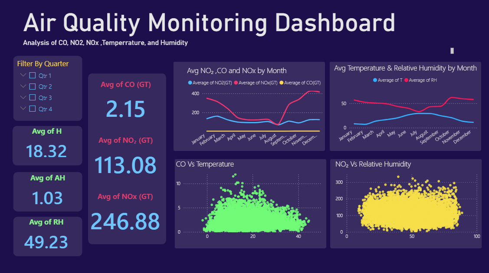

# Air_Quality_Monitoring_Dashboard

## Project Overview
This is a personal Power BI project for analyzing air quality data through interactive visualizations.

## Business Question
How do air pollutant concentrations and weather conditions vary throughout the year?

## Tools
- Power BI
- Power Query
- DAX

## Dashboard Features
- KPI Cards
- Monthly Trend Analysis
- Quarter Filter
- Scatter Plot Analysis

## Key Insights
- NOx recorded the highest average concentration.
- Temperature and humidity changed across different months.
- Quarterly filtering enables seasonal comparison
